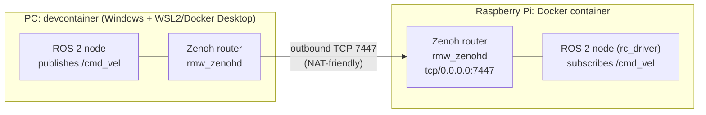

# ROS 2 PC ↔ Raspberry Pi Bridge (Zenoh)

## 1. Project Purpose

This repository runs two cooperating ROS 2 nodes across two separate Docker environments:
- A node running in a Docker container on a Raspberry Pi, which subscribes to `/cmd_vel`.
- A node running in the PC-side devcontainer (Windows + WSL2/Docker Desktop), which publishes `/cmd_vel`.

The default ROS 2 DDS discovery (Fast DDS) relies on UDP multicast, which cannot cross the NAT boundary introduced by Docker Desktop's WSL2 backend. To solve this without extra Windows-side networking configuration (no WSL2 mirrored mode, no port forwarding), both sides switch RMW implementation to `rmw_zenoh_cpp` and run a local Zenoh router (`rmw_zenohd`). The PC-side router makes an **outbound-only** connection to the Raspberry Pi's router; NAT handles the return traffic automatically, so only an inbound firewall rule for TCP 7447 is needed on the Raspberry Pi.

See [doc/communication/pc_raspi_ros2_networking.md](doc/communication/pc_raspi_ros2_networking.md) for the full design rationale and [doc/communication/zenoh_overview.md](doc/communication/zenoh_overview.md) for Zenoh/rmw_zenoh background.



The PC-side router initiates an outbound-only TCP connection to the Raspberry Pi's router; NAT handles the return traffic, so only an inbound firewall rule for TCP 7447 is needed on the Raspberry Pi side.

## 2. Starting the ROS 2 node on the Raspberry Pi side

### Build the image (via GitHub Actions)
Building and pushing the image requires a Docker Hub account. The ARM64 image is built from [.devcontainer/Dockerfile.raspi](.devcontainer/Dockerfile.raspi) using the [.github/workflows/build-image-arm64.yml](.github/workflows/build-image-arm64.yml) workflow, and pushed to Docker Hub with a timestamp tag.

1) Create repository secrets (Settings → Secrets and variables → Actions):
   - `DOCKERHUB_USERNAME`: Your Docker Hub username
   - `DOCKERHUB_TOKEN`: Docker Hub access token (create at https://hub.docker.com/settings/security)
2) Manually run the workflow: GitHub → Actions → “Build ARM64 Docker Image” → Run workflow
3) Image name and tag: see the `tags:` field in the workflow file above.

Caching is enabled via GitHub Actions cache to speed up subsequent runs.

### Installing Docker on the Raspberry Pi
- Docker installed on the Raspberry Pi:
  ```bash
  curl -fsSL https://get.docker.com -o get-docker.sh
  sudo sh get-docker.sh
  sudo usermod -aG docker $USER
  ```
  Log out and back in (or reboot) for the group membership change to take effect.

### Pull and run on the Raspberry Pi
Pull the built image:
```bash
docker pull DOCKERHUB_USERNAME/<image-name>:<tag>
```

Then use [docker_script/docker-run-for-raspi.sh](docker_script/docker-run-for-raspi.sh) to launch the container. The script mounts the parent directory of wherever it is invoked from, so run it from inside `docker_script/` (this mounts the repository root, which contains `ros2_ws` and `zenoh`, to `/home/ubuntu/work`):

```bash
cd docker_script
chmod +x docker-run-for-raspi.sh
./docker-run-for-raspi.sh
```

This starts the container with:
- `--network host`, needed for Zenoh/ROS 2 discovery
- `--device=/dev/gpiochip0` plus `--group-add` for the host's `gpio` group, which together let `rc_driver` drive the Raspberry Pi's GPIO pins directly via `gpiozero` from inside the container
- `RMW_IMPLEMENTATION=rmw_zenoh_cpp` and `ZENOH_ROUTER_CONFIG_URI`/`ZENOH_SESSION_CONFIG_URI` pointing at `zenoh/raspi_router_config.json5` / `zenoh/raspi_session_config.json5`, so the local Zenoh router listens on `tcp/0.0.0.0:7447` and the node connects to it directly instead of relying on multicast scouting

On startup it launches `rmw_zenohd` in the background, then builds the workspace and runs `ros2 launch rc_driver rc_driver.launch.py`.

### Troubleshooting
- exec format error: The container image architecture doesn’t match the host. Ensure `--platform linux/arm64` was used during build, and that you run on an arm64 host (or with emulation).
- QEMU/binfmt not registered: ensure Docker Desktop’s “Use Rosetta/Emulate architecture” features are enabled as applicable when building on non-arm64 hosts.
- Push denied or unauthorized: Verify `docker login` locally, or check `DOCKERHUB_USERNAME`/`DOCKERHUB_TOKEN` repository secrets for the GitHub Actions workflow.

## 3. Starting the ROS 2 node on the PC devcontainer side

### Windows + WSL2 prerequisites
The main devcontainer ([.devcontainer/devcontainer.json](.devcontainer/devcontainer.json)) runs ROS 2 GUI tools (Gazebo, RViz2) that are displayed on the Windows desktop via WSLg. Whenever VS Code's Dev Containers extension detects WSLg, it automatically adds a bind mount for the WSLg Wayland socket (`\\wsl.localhost\<default-distro>\mnt\wslg\runtime-dir\wayland-0`), sourced from your **default WSL distro** — regardless of whether this project's own config requests it. Because of this, before running "Reopen in Container" make sure all of the following are true:

1. At least one WSL2 distro is installed and set as default (check with `wsl -l -v`; the default is marked with `*`).
2. Docker Desktop's WSL Integration is enabled for that distro (Settings → Resources → WSL Integration → enable that distro → Apply & Restart).
3. That distro is currently running (start it with `wsl -d <distro-name>` if it shows `Stopped`). Note: if Docker Desktop's WSL Integration (see next point) is enabled for the distro, simply starting Docker Desktop will automatically start it too, so no manual step is needed in that case.

If any of these isn't satisfied, container startup fails with an error such as:
```
docker: Error response from daemon: accessing specified distro mount service: stat /run/guest-services/distro-services/<distro>.sock: no such file or directory
```

This requirement is independent of the ARM64/Raspberry Pi image build described above — it only applies to opening the main ROS 2 devcontainer on a Windows/WSL2 host.

### Connect to the Raspberry Pi's Zenoh router
Before opening the devcontainer, set the Raspberry Pi's LAN IP in [zenoh/pc_router_config.json5](zenoh/pc_router_config.json5) (`connect.endpoints`, `tcp/<raspi-ip>:7447`). The local Zenoh router (`rmw_zenohd`) then connects outbound to the Raspberry Pi's router once started (see next section).

### Start the devcontainer and verify the connection
1. Make sure the Raspberry Pi side is already running (see section 2 above), so its node is up.
2. Open this repository in VS Code and "Reopen in Container".
3. Start the local Zenoh router manually. Automatically starting it via `postStartCommand` turned out to be unreliable in this environment (see [doc/devcontainer/mystery_of_postStartCommand.md](doc/devcontainer/mystery_of_postStartCommand.md) for why), so for now run this once per container session from an integrated terminal:
   ```bash
   ros2 run rmw_zenoh_cpp rmw_zenohd
   ```
   Leave this terminal running; open a separate terminal for the next step.
4. Confirm the Raspberry Pi's node is visible from the PC side:
   ```bash
   ros2 node list
   ```
   The Raspberry Pi's node should appear in this list, confirming the PC-side router successfully connected to the Raspberry Pi's router over Zenoh.

### Troubleshooting
- `ros2 node list` (or `ros2 topic list`) shows nothing from the other side: check the PC-side `rmw_zenohd` terminal output for a confirmed connection to the Raspberry Pi's router.
- Confirm TCP 7447 isn't blocked by the Raspberry Pi's firewall.
- Confirm the Raspberry Pi's LAN IP in `zenoh/pc_router_config.json5` is correct and reachable from the PC (e.g. `nc -vz <raspi-ip> 7447` from inside the devcontainer).

## References
- Workflow: [.github/workflows/build-image-arm64.yml](.github/workflows/build-image-arm64.yml)
- Dockerfile (ARM64): [.devcontainer/Dockerfile.raspi](.devcontainer/Dockerfile.raspi)
