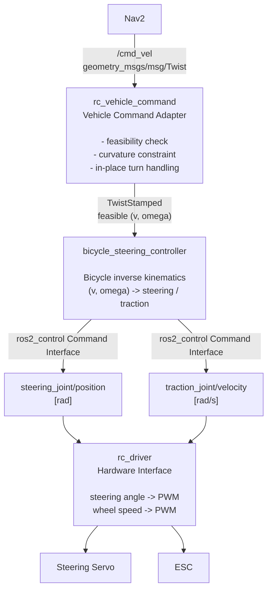

# RC Vehicle Control Architecture Design

## 1. Purpose

This document defines the ROS 2 control architecture for an RC car with one steering servo and one ESC-controlled traction motor. The design separates vehicle-command feasibility, bicycle kinematics, hardware-independent vehicle description, hardware control, and system startup/configuration.

## 2. Package structure

### Custom packages

1. `rc_vehicle_description`
2. `rc_vehicle_command`
3. `rc_driver`
4. `rc_vehicle_bringup`

### Existing ROS 2 package

5. `bicycle_steering_controller`

`bicycle_steering_controller` is part of `ros2_controllers`. It models one steering command joint and one traction command joint and applies bicycle kinematics.

## 3. Overall architecture



`rc_vehicle_description` supplies the vehicle/joint and `ros2_control` hardware model used by `controller_manager`, while `rc_vehicle_bringup` owns the runtime configuration and launch composition around the components above.

## 4. Package responsibilities and interfaces

### 4.1 `rc_vehicle_description`

**Responsibility:** Define the RC vehicle's logical robot model and its `ros2_control` interfaces.

Typical contents:

```text
rc_vehicle_description/
  urdf/
    rc_vehicle.urdf.xacro
  ros2_control/
    rc_vehicle.ros2_control.xacro
  package.xml
  CMakeLists.txt
```

Logical joints:

- `steering_joint`: virtual front steering joint representing the single steering-servo command.
- `traction_joint`: virtual rear traction joint representing the single ESC/drive command.

Required command interfaces:

```text
steering_joint/position    [rad]
traction_joint/velocity    [rad/s]
```

State interfaces should be exposed when real feedback is available. Typical candidates are:

```text
steering_joint/position
traction_joint/velocity
```

This package contains description rather than runtime conversion logic.

### 4.2 `rc_vehicle_command`

**Responsibility:** Convert an upper-layer body-velocity request into a body-velocity request that satisfies the kinematic constraints of the bicycle/Ackermann-type vehicle.

Primary component:

```text
VehicleCommandAdapter
```

Input interface:

```text
Topic: /cmd_vel
Type:  geometry_msgs/msg/Twist
Relevant values:
  linear.x   [m/s]
  angular.z  [rad/s]
```

Output interface:

```text
Topic: /bicycle_steering_controller/reference
Type:  geometry_msgs/msg/TwistStamped
Relevant values:
  twist.linear.x   [m/s]
  twist.angular.z  [rad/s]
```

The exact controller topic name depends on the configured controller instance name. On ROS 2 versions whose steering controller API differs, the message/topic configuration must follow that distribution's `steering_controllers_library` interface.

Candidate responsibilities of the adapter include:

- Rejecting or transforming an in-place rotation request (`v = 0`, `omega != 0`).
- Enforcing maximum curvature derived from steering geometry.
- Handling numerically unstable commands near zero longitudinal speed.
- Optionally applying vehicle-level speed/command policy before inverse kinematics.

A useful feasibility relation is:

```text
|omega| <= |v| / L * tan(delta_max)
```

where `L` is wheelbase and `delta_max` is the permitted steering angle.

This component must not generate PWM and should not implement servo/ESC-specific calibration.

### 4.3 `bicycle_steering_controller` (ROS 2 existing package)

**Responsibility:** Perform bicycle-model inverse kinematics and provide steering and traction commands through `ros2_control`.

Input in non-chained mode:

```text
<bicycle_controller_name>/reference
geometry_msgs/msg/TwistStamped

linear.x  : target body longitudinal velocity [m/s]
angular.z : target body angular velocity      [rad/s]
```

The controller calculates the command needed by the virtual steering and traction joints. Conceptually, the steering relation is:

```text
delta = atan(L * omega / v)
```

Relevant configuration includes:

- steering joint name
- traction joint name
- wheelbase
- traction wheel radius

Output to `rc_driver` is not a ROS publish/subscribe connection. It uses `ros2_control` command interfaces:

```text
steering_joint/position    [rad]
traction_joint/velocity    [rad/s]
```

The controller also supports state feedback/odometry facilities provided by the steering controller framework.

### 4.4 `rc_driver`

**Responsibility:** Implement the `ros2_control` hardware interface and translate physical joint commands into signals understood by the actual RC hardware.

The package changes from a direct `/cmd_vel -> PWM` node into a hardware layer.

Input from `bicycle_steering_controller`:

```text
ros2_control Command Interfaces

steering_joint/position    [rad]
traction_joint/velocity    [rad/s]
```

Typical `write()` processing:

```text
steering_joint/position
        |
        v
steering angle calibration
        |
        v
servo PWM

traction_joint/velocity
        |
        v
ESC characteristic/calibration
        |
        v
ESC PWM
```

Where hardware feedback exists, `read()` returns corresponding values through State Interfaces. If the vehicle initially has no steering or wheel-speed sensors, the feedback strategy must be explicitly defined rather than inventing measured values.

Hardware-specific responsibilities include:

- Servo center/left/right PWM calibration.
- ESC neutral/forward/reverse PWM calibration.
- Physical I/O implementation.
- Hardware enable/disable and safe-output behavior.
- Sensor acquisition, if available.

### 4.5 `rc_vehicle_bringup`

**Responsibility:** Compose, configure, and launch the complete RC vehicle control system.

Typical contents:

```text
rc_vehicle_bringup/
  launch/
    rc_vehicle.launch.py
  config/
    controllers.yaml
    vehicle_command.yaml
  package.xml
  CMakeLists.txt
```

`controllers.yaml` should contain configuration for `controller_manager` and `bicycle_steering_controller`, including names of the steering/traction joints and bicycle geometry parameters.

The launch process should normally:

1. Build/load `robot_description` from `rc_vehicle_description`.
2. Start `ros2_control` / `controller_manager` with the `rc_driver` hardware plugin.
3. Load and activate `bicycle_steering_controller`.
4. Start the `rc_vehicle_command` Vehicle Command Adapter.
5. Establish topic names/remappings needed for the upstream navigation stack.

## 5. Interface summary

| Producer | Consumer | Mechanism | Interface / message | Unit / meaning |
|---|---|---|---|---|
| Nav2 | `rc_vehicle_command` | ROS 2 topic | `/cmd_vel`, `geometry_msgs/msg/Twist` | `linear.x` m/s, `angular.z` rad/s |
| `rc_vehicle_command` | `bicycle_steering_controller` | ROS 2 topic | `<controller>/reference`, `geometry_msgs/msg/TwistStamped` | feasible `linear.x` m/s, `angular.z` rad/s |
| `bicycle_steering_controller` | `rc_driver` | `ros2_control` Command Interface | `steering_joint/position` | steering position [rad] |
| `bicycle_steering_controller` | `rc_driver` | `ros2_control` Command Interface | `traction_joint/velocity` | traction-wheel angular velocity [rad/s] |
| `rc_driver` | steering servo | hardware/PWM | steering PWM | hardware-dependent |
| `rc_driver` | ESC | hardware/PWM | ESC PWM | hardware-dependent |
| `rc_driver` | controller framework | `ros2_control` State Interface | steering/traction states | available measured state |
| `rc_vehicle_description` | `controller_manager` / hardware | URDF/Xacro | joints + `<ros2_control>` definition | structural/runtime binding |
| `rc_vehicle_bringup` | whole system | launch + YAML | controller/adapter configuration | runtime composition |

## 6. Responsibility boundaries

The most important design rule is that each layer owns only one class of conversion:

```text
Vehicle Command Adapter
  Question: Is the requested body velocity feasible for this car?

bicycle_steering_controller
  Question: Which steering angle and traction-wheel velocity realize
            the feasible body velocity under the bicycle model?

rc_driver
  Question: Which hardware commands/PWM values realize the requested
            steering angle and traction velocity on this specific RC car?
```

Consequently:

- PWM knowledge must not leak into `rc_vehicle_command` or `bicycle_steering_controller`.
- Bicycle inverse kinematics should not be duplicated in `rc_driver`.
- Servo/ESC calibration belongs to `rc_driver`.
- Launch-time wiring and controller parameters belong to `rc_vehicle_bringup`.
- Robot/joint/interface definitions belong to `rc_vehicle_description`.

## 7. Runtime sequence

For one command cycle:

```text
1. Nav2 publishes /cmd_vel.
2. VehicleCommandAdapter receives (v, omega).
3. VehicleCommandAdapter applies vehicle kinematic feasibility policy.
4. It publishes the adjusted TwistStamped reference.
5. bicycle_steering_controller performs bicycle inverse kinematics.
6. The controller writes steering_joint/position and
   traction_joint/velocity command interfaces.
7. controller_manager invokes the rc_driver hardware write path.
8. rc_driver maps the two physical commands to calibrated PWM outputs.
9. The servo and ESC actuate the RC vehicle.
10. When sensors are present, rc_driver reads state and exposes it through
    ros2_control State Interfaces for controller/odometry use.
```

## 8. Configuration ownership

Recommended ownership is:

```text
rc_vehicle_description
  - URDF geometry needed to describe the robot
  - joint definitions
  - ros2_control hardware/plugin declaration

rc_vehicle_command
  - feasibility-policy implementation

rc_vehicle_bringup/config/vehicle_command.yaml
  - command-adapter thresholds and runtime limits

rc_vehicle_bringup/config/controllers.yaml
  - bicycle_steering_controller parameters
  - wheelbase / traction wheel radius
  - steering and traction joint names
  - controller runtime settings

rc_driver
  - hardware communication implementation
  - PWM conversion/calibration implementation
```

If a value is required both as descriptive geometry and as a controller parameter (for example wheelbase), the project should define a clear single source of truth or an explicit synchronization mechanism to prevent inconsistent configuration.

## 9. Safety and edge cases to define before implementation

The following policies should be made explicit before implementation:

1. Behavior for `v = 0` and `omega != 0`.
2. Maximum steering angle / maximum curvature.
3. Behavior as `|v|` approaches zero.
4. Forward and reverse steering sign conventions.
5. Maximum drive speed and acceleration policy.
6. Steering slew/rate policy if required by the servo.
7. Command timeout and safe PWM output on communication loss.
8. ESC neutral/startup behavior.
9. Feedback behavior when no encoder or steering sensor exists.
10. Failure response when the hardware interface reports an I/O error.

## 10. External ROS 2 references

This design is based on the ROS 2 `ros2_controllers` steering architecture:

- `bicycle_steering_controller`: https://control.ros.org/master/doc/ros2_controllers/bicycle_steering_controller/doc/userdoc.html
- `steering_controllers_library`: https://control.ros.org/rolling/doc/ros2_controllers/steering_controllers_library/doc/userdoc.html
- CarlikeBot bicycle-controller demo: https://control.ros.org/lyrical/doc/ros2_control_demos/example_11/doc/userdoc.html

The selected ROS 2 distribution's documentation is authoritative for exact topic names, message forms, parameters, and controller APIs because these details differ between releases.
