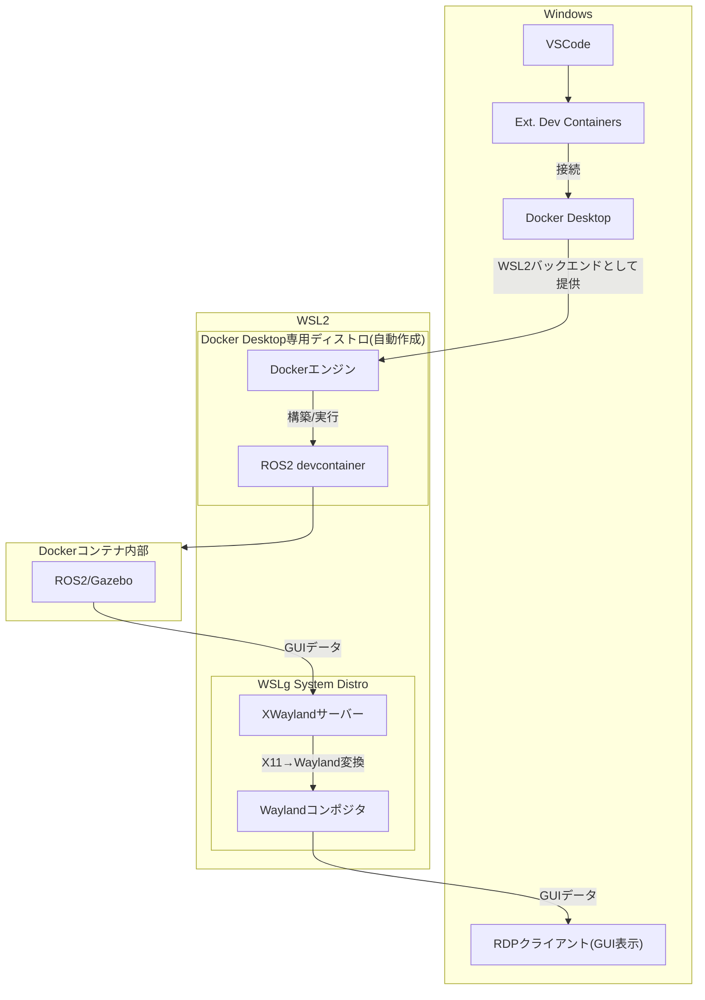

# Dev Containersの仕組み

このドキュメントでは、WindowsでVSCodeの拡張機能Dev Containersを使用してROS2を動かす際のWSL（Windows Subsystem for Linux）、Docker、及びVSCodeの関係を図解します。

## アーキテクチャ図

## 説明

1. **Windows**:
   - VSCodeはエディタとして機能し、拡張機能を通じてコンテナに接続します。
   - 図中の「Ext. Dev Containers」は、VSCodeの「Dev Containers」（Microsoft提供）という名称の拡張機能です。以前は「Remote - Containers」という名称でしたが名称が変更されました。この拡張機能はVSCodeからDockerコンテナに直接接続し、devcontainer設定に基づいたコンテナ環境を構築・利用できるようにします。
   - RDPクライアントはWindows標準のリモートデスクトッププロトコル技術を利用し、WSLg経由でDockerコンテナ内部のGUIアプリケーションをWindowsデスクトップ上に表示します。
   - **Docker Desktop**はWindows上で常駐するアプリケーションで、Dockerを利用するために起動している必要があります。VSCodeの「Ext. Dev Containers」拡張は、Windows側の名前付きパイプ経由でDocker Desktopに直接接続し、devcontainer設定に基づいたコンテナのビルド・起動・管理を行います。この経路はユーザーが別途セットアップするWSLディストロ（Ubuntu等）を経由しません。
   - 既定の「WSL2 based engine」設定では、実際のDockerエンジン（dockerd）はDocker Desktopインストール時に自動作成される専用の隠しWSL2ディストリビューション（`docker-desktop`、`docker-desktop-data`）内で動作しています。ROS2 devcontainerもこのディストロ内で動きます。

2. **WSL2**:
   - WSL2はWindows上でLinuxカーネルを実行するための技術的な基盤です。
   - 図中の「Docker Desktop専用ディストロ」は、Docker Desktopのインストール時に自動的に作成される隠しディストロ（`docker-desktop`、`docker-desktop-data`）です。ユーザーが意識的にセットアップする必要はなく、Dockerエンジン（dockerd）とコンテナはこの中で動作します。
   - 図中の「ROS2 devcontainer」は、`.devcontainer/Dockerfile`で定義されたDockerコンテナを指します。このコンテナには以下が含まれています。
     - ROS2 Iron（ベースイメージ）
     - Gazeboシミュレーター
     - 開発ツール（コンパイラ、デバッガなど）
     - ROS2ワークスペース（/home/vscode/ros2_projects）
     また、`.devcontainer/devcontainer.json`によって、VSCodeとの統合、ボリュームマウント、X11転送などが設定されています。
   - Docker Desktop専用ディストロ内でDockerエンジンが動作し、ROS2 devcontainerを構築・実行します。
   - この階層構造により、Windows上でLinuxアプリケーションを効率的に実行できます。

3. **Dockerコンテナ内部**:
   - GazeboなどのROS2アプリケーションが実行されます。
   - GUIアプリケーション（Gazeboなど）はWSLgを通じてWindowsデスクトップ上に表示されます。

この構成により、Windows環境でもLinuxベースのROS2を効率的に開発・実行することが可能になります。

## Dockerコンテナ内部のGUIアプリケーション表示の仕組み

WSLg（Windows Subsystem for Linux GUI）を使用したGUIアプリケーションの表示の仕組みは以下の通りです：

1. **WSLgのアーキテクチャ**:
   - WSLgは、WSL2内部に専用の「WSLg System Distro」というLinuxディストリビューションを起動します。
   - WSLg System Distro内にはWaylandコンポジタとXWaylandサーバーが含まれています。
   - Windows側では**RDPクライアント**がGUIの表示を担当します。これはWindows標準のRDPテクノロジーを利用しており、特別なソフトウェアのインストールは不要です。

2. **表示の流れ**:
   1. WSL2が起動すると、WSLg System Distroが自動的に起動します。
   2. Dockerコンテナ内のGUIアプリケーション（Gazeboなど）は、XWaylandサーバーに接続します。
   3. XWaylandサーバーはX11プロトコルをWaylandプロトコルに変換します。
   4. WaylandコンポジタはGUIデータをRDPプロトコルに変換します。
   5. **Windows側のRDPクライアントがRDPプロトコルを受け取り、GUIをWindowsデスクトップ上にネイティブウィンドウとして表示します**。このプロセスはユーザーには透過的で、LinuxアプリケーションがWindowsアプリケーションのように見えます。

3. **WSLgの利点**:
   - 外部のXサーバーが不要になり、設定が大幅に簡略化されます。
   - **Windowsネイティブのリモートデスクトッププロトコル（RDP）を使用することで、高品質なグラフィックス表示と滑らかな操作感を実現します**。
   - オーディオやクリップボードの共有などの機能も自動的に利用可能になります。
   - 特別な環境変数の設定やX11転送の設定が不要で、プラグアンドプレイで動作します。

4. **Dockerコンテナでの利用**:
   - WSL2上で動作するDockerコンテナは、WSLgの機能を自動的に利用できます。
   - コンテナ内のGUIアプリケーションは、特別な設定なしでWSLgを通じてWindows上に表示されます。
   - **最終的にはWindows標準のRDPクライアントによってGUIが表示されるため、Windowsとの統合性が高く、ネイティブアプリケーションのような使用感が得られます**。
