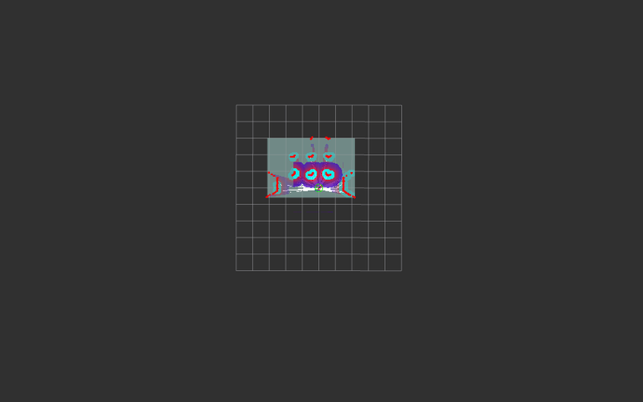

# Gazeboシミュレーションにおけるレーザースキャン異常の分析

## 1. 問題の概要

ROS2とGazeboを使用したナビゲーションシミュレーションにおいて、特定の環境条件下でレーザースキャン（laserscanトピック）に異常が発生する問題が確認されました。具体的には、ロボットの後方に実際には存在しない「大きな壁」があるかのような信号がRViz2上に表示される現象です。

この問題は環境依存性があり、四方を壁で囲まれていない開放的なモデル（[`turtlebot3_world_no_wall`](ref/turtlebot3_world_no_wall)）でのみ発生し、四方を壁で囲まれたモデル（[`turtlebot3_world`](ref/turtlebot3_world)）では発生しませんでした。

Note:<br>
各モデルは/opt/ros/jazzy/share/nav2_minimal_tb3_sim/modelsに格納し、<br>
tb3_simulation_launch.pyを使用したlaunchコマンドのworld引数で指定する.xacroファイル([例](ref/custom_tb3_sandbox.sdf.xacro))の中でモデルへの参照を切り替えています。<br>
例: ros2 launch nav2_bringup tb3_simulation_launch.py world:=/path/to/xxxx.xacro

## 2. 現象の詳細

### 問題の症状
- RViz2上でロボットの後方に「大きな壁」のようなレーザースキャンデータが表示される
- この「壁」は実際のGazebo環境には存在しない
- レーザースキャンデータが不自然な距離値を示す


### 再現条件
- 四方を壁で囲まれていない開放的な環境を使用
- レーザースキャナーの最大検出距離が長い（20.0m）設定

### 影響
- ナビゲーションアルゴリズムが誤った障害物を検出
- 経路計画が不正確になる可能性
- SLAMの精度低下

## 3. 環境情報

### シミュレーション環境
- **ROS2 バージョン**: Jazzy Jellyfish
- **Gazebo バージョン**: Gazebo Sim (Garden)
- **ロボットモデル**: TurtleBot3 Waffle

### 関連ファイル
- **ワールドファイル**: [`custom_tb3_sandbox.sdf.xacro`](ref/custom_tb3_sandbox.sdf.xacro)
- **環境モデル**: [`turtlebot3_world_no_wall`](ref/turtlebot3_world_no_wall/)(/opt/ros/jazzy/share/nav2_minimal_tb3_sim/modelsに配置します)
- **ロボットSDF**: [`gz_waffle.sdf.xacro`](ref/gz_waffle.sdf.xacro)(/opt/ros/jazzy/share/nav2_minimal_tb3_sim/urdfに配置します)

## 4. 実施した対策と結果

### 対策内容
gz_waffle.sdf.xacroで定義されているレーザースキャナーの最大検出距離を3.5mに修正しました。(実際のTurtleBot3 LDS-01の仕様)

#### 対策前
```xml
<sensor name="hls_lfcd_lds" type="gpu_lidar">
  <ray>
    <range>
      <min>0.00001</min>
      <max>20.0</max>  <!-- 問題の原因となった設定 -->
      <resolution>0.015000</resolution>
    </range>
  </ray>
</sensor>
```

#### 対策後
```xml
<sensor name="hls_lfcd_lds" type="gpu_lidar">
  <ray>
    <range>
      <min>0.00001</min>
      <max>3.5</max>  <!-- 20.0から3.5に変更 -->
      <resolution>0.015000</resolution>
    </range>
  </ray>
</sensor>
```

### 起動コマンド
```bash
ros2 launch nav2_bringup tb3_simulation_launch.py slam:=True world:=./custom_tb3_sandbox.sdf.xacro
```

### 結果
- RViz2上の「大きな壁」のような異常なレーザースキャンデータが消失
- より現実的なレーザースキャン結果が得られるようになった
- ナビゲーションの精度が向上



## 5. 原因の推定

問題の根本原因は完全には特定されていませんが、以下の要因が考えられます：

### 主要な推定原因(by AI)
1. **Gazeboの数値計算精度問題**
   - 20mという長距離でのレイキャスティング計算で数値誤差が蓄積
   - GPU LiDARプラグインの内部処理での浮動小数点精度の限界
   - 遠距離での微小な計算誤差が「仮想的な反射」として現れる

2. **Gazeboの境界条件処理**
   - シミュレーション空間の境界での予期しない反射処理
   - 無限遠での境界条件が適切に処理されない
   - レイが地面と平行に飛ぶ際の特殊なケース処理

3. **GPU LiDARプラグインの実装上の問題**
   - 長距離レイキャスティングでの内部バッファオーバーフロー
   - レイの終端処理での異常値生成
   - ハードウェア固有の計算精度問題

### 考察(by AI)
理論的には100x100mの地面が定義されている環境で20mのレーザースキャナーは問題なく動作するはずですが、実際には異常が発生しました。これはGazeboシミュレーターの内部実装における制限や精度の問題が原因と考えられます。

## 6. 技術的背景

### レイキャスティングとは
レイキャスティングは、3D空間において「光線（レイ）」を仮想的に飛ばして、その光線が物体と交差する点を計算する技術です。

#### 基本的な仕組み
```
レイ = 起点 + 方向ベクトル × 距離
```
- **起点**: レイが始まる位置（例：LiDARセンサーの位置）
- **方向**: レイが飛ぶ方向（例：360度回転）
- **距離**: レイがどこまで飛ぶか

#### LiDARシミュレーションでの応用
1. **360本のレイ**を水平方向に放射（1度間隔）
2. 各レイが障害物と交差する距離を計算
3. 距離データを配列として出力
4. RViz2でレーザースキャンとして可視化
