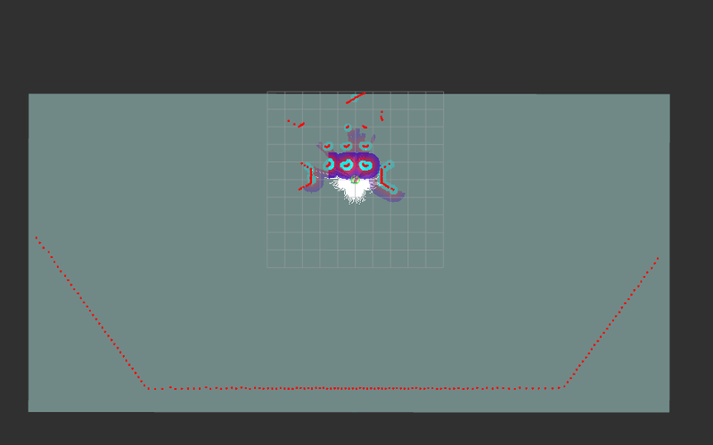
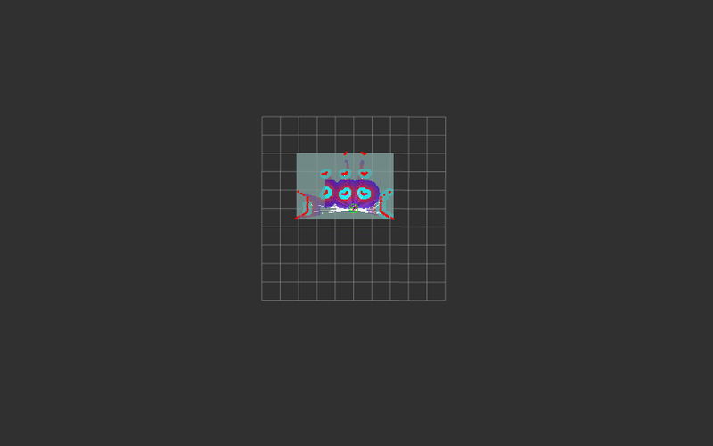

# Analysis of Laser Scan Anomalies in Gazebo Simulation

## 1. Problem Overview

An issue has been identified in navigation simulations using ROS2 and Gazebo, where laser scan (laserscan topic) anomalies occur under specific environmental conditions. Specifically, a phenomenon where signals appear in RViz2 as if there is a "large wall" behind the robot that does not actually exist.

This problem has environmental dependencies and only occurs in open models without surrounding walls ([`turtlebot3_world_no_wall`](ref/turtlebot3_world_no_wall)), while it does not occur in models enclosed by walls on all sides ([`turtlebot3_world`](ref/turtlebot3_world)).

Note:<br>
Each model is stored in /opt/ros/jazzy/share/nav2_minimal_tb3_sim/models,<br>
and model references are switched within the .xacro file ([example](ref/custom_tb3_sandbox.sdf.xacro)) specified by the world argument of the launch command using tb3_simulation_launch.py.<br>
Example: ros2 launch nav2_bringup tb3_simulation_launch.py world:=/path/to/xxxx.xacro

## 2. Detailed Phenomenon

### Symptoms
- Laser scan data appears in RViz2 as a "large wall" behind the robot
- This "wall" does not actually exist in the Gazebo environment
- Laser scan data shows unnatural distance values



### Reproduction Conditions
- Using an open environment without walls on all sides
- Laser scanner maximum detection distance set to long range (20.0m)

### Impact
- Navigation algorithms detect non-existent obstacles
- Potential inaccuracies in path planning
- Reduced SLAM accuracy

## 3. Environment Information

### Simulation Environment
- **ROS2 Version**: Jazzy Jellyfish
- **Gazebo Version**: Gazebo Sim (Garden)
- **Robot Model**: TurtleBot3 Waffle

### Related Files
- **World File**: [`custom_tb3_sandbox.sdf.xacro`](ref/custom_tb3_sandbox.sdf.xacro)
- **Environment Model**: [`turtlebot3_world_no_wall`](ref/turtlebot3_world_no_wall/) (place in /opt/ros/jazzy/share/nav2_minimal_tb3_sim/models)
- **Robot SDF**: [`gz_waffle.sdf.xacro`](ref/gz_waffle.sdf.xacro) (place in /opt/ros/jazzy/share/nav2_minimal_tb3_sim/urdf)

## 4. Implemented Countermeasures and Results

### Countermeasure
Modified the maximum detection distance of the laser scanner defined in gz_waffle.sdf.xacro to 3.5m (matching the actual specifications of TurtleBot3 LDS-01).

#### Before Modification
```xml
<sensor name="hls_lfcd_lds" type="gpu_lidar">
  <ray>
    <range>
      <min>0.00001</min>
      <max>20.0</max>  <!-- Setting that caused the problem -->
      <resolution>0.015000</resolution>
    </range>
  </ray>
</sensor>
```

#### After Modification
```xml
<sensor name="hls_lfcd_lds" type="gpu_lidar">
  <ray>
    <range>
      <min>0.00001</min>
      <max>3.5</max>  <!-- Changed from 20.0 to 3.5 -->
      <resolution>0.015000</resolution>
    </range>
  </ray>
</sensor>
```

### Launch Command
```bash
ros2 launch nav2_bringup tb3_simulation_launch.py slam:=True world:=./custom_tb3_sandbox.sdf.xacro
```

### Results
- The anomalous laser scan data appearing as a "large wall" in RViz2 disappeared
- More realistic laser scan results were obtained
- Navigation accuracy improved



## 5. Estimated Causes (by AI)

The root cause has not been fully identified, but the following factors are considered:

### Main Estimated Causes
1. **Numerical Calculation Precision Issues in Gazebo**
   - Accumulation of numerical errors in ray casting calculations at long distances (20m)
   - Floating-point precision limitations in the internal processing of the GPU LiDAR plugin
   - Small calculation errors at long distances appearing as "virtual reflections"

2. **Boundary Condition Processing in Gazebo**
   - Unexpected reflection processing at simulation space boundaries
   - Improper handling of boundary conditions at infinity
   - Special case handling when rays travel parallel to the ground

3. **Implementation Issues in the GPU LiDAR Plugin**
   - Internal buffer overflow in long-distance ray casting
   - Anomalous value generation in ray termination processing
   - Hardware-specific calculation precision issues

### Discussion
Theoretically, a 20m laser scanner should work without issues in an environment with a defined 100x100m ground, but anomalies occurred in practice. This is likely due to limitations or precision issues in the internal implementation of the Gazebo simulator.

## 6. Technical Background

### What is Ray Casting
Ray casting is a technique for calculating the intersection points of "rays" virtually projected in 3D space with objects.

#### Basic Mechanism
```
Ray = Origin + Direction Vector × Distance
```
- **Origin**: Position where the ray starts (e.g., LiDAR sensor position)
- **Direction**: Direction in which the ray travels (e.g., 360-degree rotation)
- **Distance**: How far the ray travels

#### Application in LiDAR Simulation
1. Project **360 rays** horizontally in a radial pattern (1-degree intervals)
2. Calculate the distance at which each ray intersects with obstacles
3. Output the distance data as an array
4. Visualize as laser scan in RViz2
